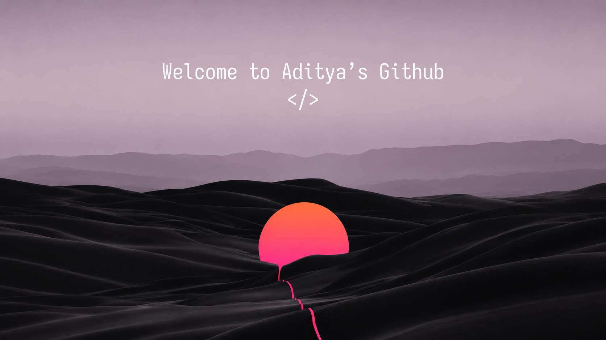

  
  
  
  
  

 

<h2 align="center">  <em>About me </em></h2>

 

  Hello There! <em><b> I'm Aditya Nandan </b></em>, a final year Computer Science student at Graphic Era Dehradun. I'm a self-taught full-stack and AI developer who loves building things with local/open-source tooling. I've worked as a Frontend Intern at Quivr (YC W24), won national and international competitions in web technologies, and I'm currently building AI/ML portfolio projects.

 

      <em><b> B.Tech CSE @ Graphic Era Dehradun (CGPA 8.54) </b></em>  
      <em><b> Frontend Intern @ Quivr (YC W24) </b></em> 
      <em><b> WorldSkills Asia 2025 Medallion of Excellence (5th) </b></em> 
      <em><b> Indiaskills 2024 Bronze Medallist (5th) </b></em> 

 
 
<h2 align="center">  <em> Technologies </em> </h2>

  
  
  
  
  
  
  
  
  
  
  
  
  
  
  
  
  
  
  
  
  
  

 

<h2 align="center"">  <em> Statistics </em> </h2>

 

